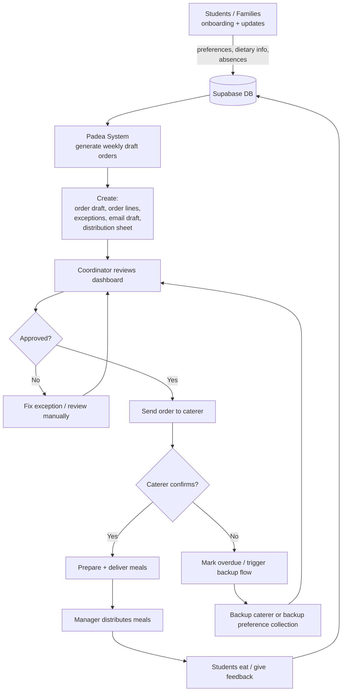

# Padea Catering Operations Prototype

This repository contains a working prototype for improving Padea’s tutoring-session catering workflow. The system uses Supabase as the operational database, Python scripts as workflow workers, and Streamlit as a lightweight coordinator dashboard.

The goal is to reduce manual coordinator effort, make student meal preferences explicit, generate weekly draft orders, surface operational exceptions, and track caterer confirmation state.

## What the prototype does

* Stores sessions, students, caterers, menus, food profiles, absences, exclusions, manager contacts and caterer contacts in Supabase.
* Generates weekly draft catering orders from database state.
* Applies absences and full/partial school exclusions.
* Selects meals using preferred item → backup item → safe default logic.
* Checks dietary compatibility and caterer minimum quantities.
* Produces caterer email drafts and student distribution sheets.
* Tracks order status through approval, sending, confirmation, overdue and backup-required states.
* Provides a Streamlit dashboard for orders and exceptions.
* Simulates family absence and preference updates.
* Demonstrates backup caterer escalation when a primary caterer does not confirm.

## Architecture



The physical delivery process is mostly unchanged: the caterer delivers food, and the on-site manager receives and distributes. This prototype focuses on improving the upstream coordination: preference capture, order generation, exception handling, confirmation tracking and backup escalation.

Note: the physical delivery workflow is intentionally not over-modelled. Drivers and managers still coordinate by mobile if needed. The prototype improves upstream order creation, contact visibility, confirmation tracking, exception handling and backup escalation.

## Setup

Create and activate a virtual environment:

```bash
python -m venv venv
source venv/bin/activate
pip install -r requirements.txt
```

Create `.env` from `.env.example`:

```bash
cp .env.example .env
```

Fill in:

```env
SUPABASE_URL="https://your-project-ref.supabase.co"
SUPABASE_KEY="your-service-role-or-secret-key"
OUTPUT_DIR="output"
```

Do not commit `.env`.

## Run the dashboard

```bash
streamlit run dashboard.py
```

## Generate weekly orders

Dry run:

```bash
python -m scripts.generate_weekly_orders --start 2026-05-01 --days 7 --dry-run
```

Write generated orders to Supabase:

```bash
python -m scripts.generate_weekly_orders --start 2026-05-01 --days 7 --write --replace
```

This creates/updates order records, order lines, exceptions, email drafts and distribution sheets.

## Order lifecycle demo

Approve an order:

```bash
python -m scripts.demo_order_lifecycle approve --order-id <ORDER_ID>
```

Send to caterer with a short confirmation deadline:

```bash
python -m scripts.demo_order_lifecycle send --order-id <ORDER_ID> --confirmation-minutes 1
```

Run the confirmation deadline checker:

```bash
python -m scripts.check_confirmation_deadlines
```

Or run it continuously:

```bash
python -m scripts.check_confirmation_deadlines --watch --interval 5
```

Mark backup required:

```bash
python -m scripts.demo_order_lifecycle require-backup --order-id <ORDER_ID>
```

## Backup caterer demo

```bash
python -m scripts.demo_backup_caterer --order-id <ORDER_ID> --write
```

If students do not have preferences for the backup caterer, the script generates an outreach list. In production, this would trigger SMS/email preference collection.

## Family update demos

Simulate an absence email:

```bash
python -m scripts.demo_process_absence_email \
  --student-id stu_henry_hill_moreton_bay_boys_college \
  --session-id sess_moreton_bay_boys_college_tuesday \
  --absence-date 2026-05-02 \
  --raw-text "Hi Padea, Henry is sick and won't be attending tutoring this week."
```

Simulate a meal preference update:

```bash
python -m scripts.demo_update_preference \
  --student-id stu_henry_hill_moreton_bay_boys_college \
  --caterer-id cat_lakehouse_victoria_point \
  --preferred-menu-item-id menu_lakehouse_victoria_point_05
```

In the prototype, the generator can be rerun after these updates to show the changed state. In production, the system should regenerate only the affected draft order or create an exception if the order has already been sent.

## Edge-case tests

```bash
python -m scripts.test_order_edge_cases
```

The tests cover full exclusions, partial year-level exclusions, and individual absences.

## Key design decisions

* The database is the source of truth.
* Core ordering logic is deterministic and auditable.
* LLMs are best used at messy boundaries, such as parsing family emails or manager notes into structured proposed updates.
* Routine operations are automated; uncertain or unsafe states become visible exceptions.
* Student preferences are collected during onboarding for the primary caterer only. Backup caterer preferences are collected only if needed, to minimise friction.
* `orders` models the lifecycle of a real catering job.
* `exceptions` provides the coordinator with a queue of operational issues.

## Current limitations

* No real Gmail integration.
* No real SMS integration.
* No real email sending.
* No production authentication or role-based permissions.
* Backup preference collection is represented as an outreach list rather than a live form.
* The Streamlit dashboard is a prototype, not a production UI.
* Absence/preference updates currently demonstrate changed state by rerunning generation; production should scope regeneration to the affected order.

## Future extensions

* Real ingestion from `families@padea.com.au`.
* LLM-assisted email triage into structured updates.
* Dynamic preference forms linked to student/session/caterer identity.
* SMS/email backup preference collection.
* Scoped regeneration of individual orders.
* Persistent student-meal assignment table for audit and distribution.
* Stronger structured dietary/allergy modelling.
* Order state transition audit log.
* Production dashboard with action buttons.
